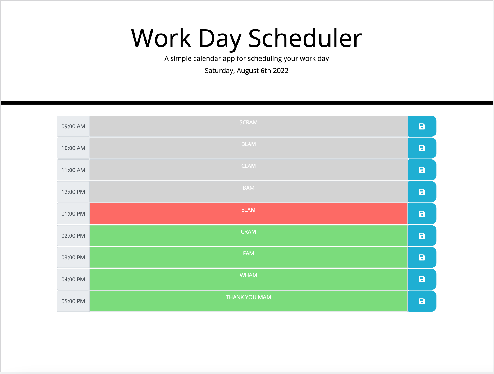

# Challenge 05

## Description
- This challenge was to create a planner app that tracks the time of day  using moment.js, jQuery, CSS, and HTML.

## Functionality
- Planner
  - The planner has 9 time blocks from 9am - 5pm in 1 hour increments.
  - As the day progresses, the planner will indicate at which time block the day is at currently.
    - Grey - Past
    - Red - Present
    - Green - Future
  - The user is able to input their own text for each time block and save their inputs.
    - The inputs will persist on page refresh. 

### Website

### Links
[Planner](https://ahuang23.github.io/C05_Planner/)
